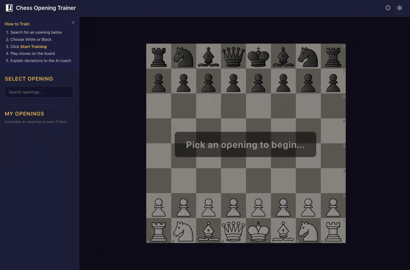

# Chess Opening Trainer

Practice chess openings and get AI-powered coaching when you go wrong.



## What It Does

Play through opening main lines on an interactive board. When you make a wrong move, the app asks you to explain your reasoning, then an AI coach -- informed by Stockfish engine analysis -- gives you personalized feedback on your thinking.

**The training loop:**

1. Pick an opening from the catalog (~3,600 lines from the ECO database)
2. Play through the main line move by move
3. If you deviate, explain why you chose that move
4. Stockfish evaluates both the book move and yours
5. An AI coach addresses your specific reasoning and teaches the principles behind the correct move
6. The board resets to the correct position and you continue
7. At the end of the line, reflect on the opening and ask questions

## Features

- **Full ECO opening catalog** -- ~3,600 openings parsed from ECO codes A through E
- **My Openings** -- save favorites for quick access (persisted in localStorage)
- **Stockfish 17 analysis** -- runs entirely in-browser via WASM, no server needed
- **AI coaching** -- choose between Claude (Anthropic API) or a local Ollama model
- **End-of-session reflection** -- discuss what you learned with the AI coach after completing a line
- **Dark theme** -- easy on the eyes during long study sessions

## Getting Started

### Prerequisites

- Node.js 22+
- An Anthropic API key **or** a local [Ollama](https://ollama.com) instance

### Install and Run

```bash
git clone https://github.com/jamisonbryant/chess-opening-trainer.git
cd chess-opening-trainer
npm install
npm run dev
```

Open http://localhost:5173 and configure your AI provider in the settings panel (gear icon).

### AI Provider Setup

**Claude (Anthropic API):** Enter your API key in settings. Calls go directly from the browser using the Anthropic JS SDK. You'll need a key with usage credits.

**Ollama (local):** Install Ollama, pull a model (e.g., `ollama pull llama3.1`), and make sure it's running on the default port. Select "Ollama" in settings and choose your model.

## Tech Stack

| Layer | Technology |
|-------|-----------|
| Framework | Vue 3 (Composition API, `<script setup>`) |
| Language | TypeScript (strict mode) |
| Build | Vite 7 |
| State | Pinia with localStorage persistence |
| Board | vue3-chessboard + chess.js |
| Engine | Stockfish 17 (WASM Web Worker) |
| AI | Anthropic Claude / Ollama |
| Markdown | marked |
| Tests | Vitest |

## Architecture

```
src/
  components/
    ChessTrainer.vue    # Main training session lifecycle
    OpeningSelector.vue  # Left sidebar -- opening catalog + favorites
    TrainingPanel.vue    # Right sidebar -- AI coaching chat
    SettingsPanel.vue    # AI provider configuration
  services/
    ai/                  # AI provider abstraction (Anthropic, Ollama)
    stockfish.ts         # Stockfish WASM worker management
  stores/
    training.ts          # Session state (phase, moves, history)
    settings.ts          # Provider config (localStorage-synced)
  data/
    eco/                 # ECO opening database (A-E TSV files)
    openings.ts          # Opening type + lookup
    openings-parser.ts   # TSV parser with color inference
```

The app is fully client-side. No backend server is needed -- Stockfish runs in a Web Worker and AI API calls go directly from the browser.

## Development

```bash
npm run dev            # Dev server with HMR
npm run build          # Type-check + production build
npm test               # Run tests
npm run test:coverage  # Tests with coverage report
```

## Acknowledgments

Opening data sourced from the [Lichess chess-openings](https://github.com/lichess-org/chess-openings) dataset (public domain).

## License

[MIT](LICENSE)
